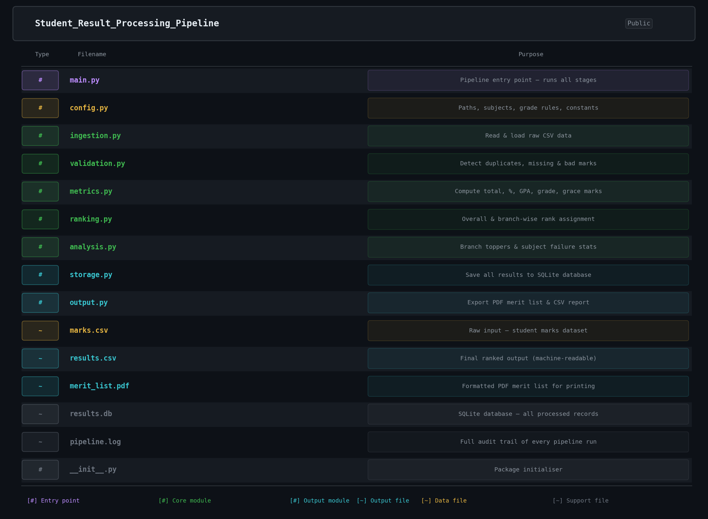

 Student Result Processing Pipeline

A Python-based end-to-end data pipeline that ingests raw student marks, validates data integrity, computes academic metrics, ranks students, and generates a merit list in both PDF and CSV formats — backed by a SQLite database and full audit logging.


Table of Contents

- [Overview](#overview)
- [Features](#features)
- [Getting Started](#getting-started)
- [Input Format](#input-format)
- [Pipeline Stages](#pipeline-stages)
- [Grading System](#grading-system)
- [Output](#output)
- [Configuration](#configuration)
- [Tech Stack](#tech-stack)

---

 Overview

This pipeline automates the full student result workflow — from reading a raw CSV of marks, detecting bad data, computing grades and GPA, ranking students, all the way to generating a formatted PDF merit list and a machine-readable CSV. Everything is logged and stored in a SQLite database for audit and querying.

---

 Features

Category  Details 

Validation | Detects negative marks, marks exceeding maximum, missing values, duplicate roll numbers |
Grace Marks | Up to 5 grace marks applied to at most 1 failing subject per student |
Metrics | Total, percentage, GPA (0–10 scale), letter grade (O / A+ / A / B+ / B / C / F) |
Ranking | Overall rank + branch-wise rank with multi-criteria tie-breaking |
Analysis | Branch toppers, subject-wise failure counts and failure rates |
Storage | SQLite with separate tables for students, marks, results, and rejected records |
Output| Colour-coded PDF merit list + CSV; full pipeline log |

---

Getting Started

Prerequisites

- Python 3.10 or higher
- pip

Installation

```bash
# Clone the repository
git clone https://github.com/your-username/student-result-pipeline.git
cd student-result-pipeline

# Install dependencies
pip install -r requirements.txt
```

Run

```bash
python main.py
```

Outputs are written to the `output/` folder. Logs go to `logs/pipeline.log`.

---

 Input Format

Place your CSV at `data/raw_marks.csv`. Required columns:

| Column | Type | Description |
|---|---|---|
| `roll_number` | string | Unique student identifier |
| `name` | string | Student full name |
| `branch` | string | Department (e.g. CSE, ECE, MECH) |
| `math` | integer | Marks out of 100 |
| `physics` | integer | Marks out of 100 |
| `chemistry` | integer | Marks out of 100 |
| `english` | integer | Marks out of 100 |
| `programming` | integer | Marks out of 100 |

Example:

```csv
roll_number,name,branch,math,physics,chemistry,english,programming
CS001,Sneha Reddy,CSE,95,92,89,94,98
EC001,Divya Pillai,ECE,95,98,92,96,88
```

> Column names are case-insensitive and extra whitespace is trimmed automatically.

---

Pipeline Stages



---

Grading System

| Percentage | Grade | GPA |
|---|---|---|
| ≥ 90% | O (Outstanding) | 10.0 |
| ≥ 80% | A+ | 9.0 |
| ≥ 70% | A | 8.0 |
| ≥ 60% | B+ | 7.0 |
| ≥ 50% | B | 6.0 |
| ≥ 40% | C | 5.0 |
| < 40% | F (Fail) | 0.0 |

**Grace Mark Rule:** If a student fails in exactly **one** subject and the deficit is **≤ 5 marks**, the subject mark is raised to the passing mark (40). This is logged and flagged in the output.

**Tie-breaking (in order):**
1. Higher total percentage
2. Higher individual subject scores (compared subject by subject)
3. Lower standard deviation across subjects (more consistent student wins)

---

Output

PDF Merit List (`output/merit_list.pdf`)
- Overall ranked table with colour-coded grades and pass/fail status
- Branch-wise toppers section
- Subject failure analysis table
- Grading key in the footer

CSV Merit List (`output/merit_list.csv`)

```
overall_rank, branch_rank, roll_number, name, branch,
math, physics, chemistry, english, programming,
total, percentage, gpa, grade, pass_status, grace_applied
```

SQLite Database (`data/results.db`)

| Table | Contents |
|---|---|
| `students` | roll_number, name, branch |
| `marks` | Subject-wise marks + grace_applied flag |
| `results` | Total, percentage, GPA, grade, pass_status, ranks |
| `rejected_records` | Invalid rows with rejection reason |

---

Configuration

All tuneable parameters live in `src/config.py`:

```python
# Add or rename subjects (name → max marks)
SUBJECTS = {
    "math": 100,
    "physics": 100,
    "chemistry": 100,
    "english": 100,
    "programming": 100,
}

PASSING_MARK   = 40   # minimum per subject
GRACE_MARK_MAX =  5   # maximum grace marks per subject
```

No other file needs to change when adjusting subjects, paths, or grading thresholds.

---

Tech Stack

| Library | Purpose |
|---|---|
| `pandas` | Data ingestion, transformation, validation |
| `reportlab` | PDF generation |
| `sqlite3` | Built-in database storage |
| `logging` | Dual-channel audit trail (file + console) |
